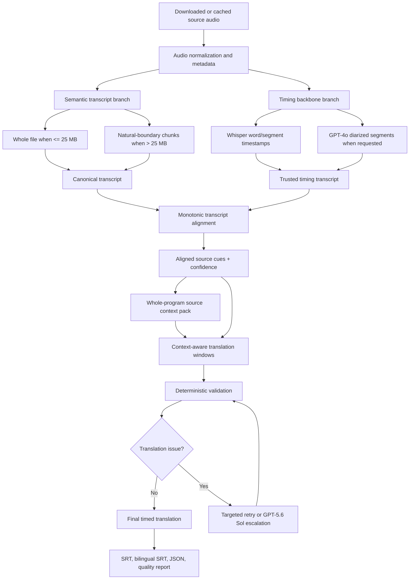

# Transcribe + LLM High-Quality Subtitle Pipeline Plan

## Status

- Planning document only; no runtime behavior changes are included here.
- Keep the existing `gpt-realtime-translate` route intact.
- Add a separate, opt-in `transcribe_llm` route for high-quality offline
  bilingual subtitles.
- Do not make the new route the default until it passes representative A/B
  evaluation against the existing Realtime + Global Context Polish route.

## Product decision

The project should expose two first-class processing modes with different
objectives:

| Mode | Primary objective | Recommended use |
| --- | --- | --- |
| `realtime` | Fast, continuously streamed interpretation | Live media, quick drafts, immediate comprehension |
| `transcribe_llm` | Accurate, auditable, reusable final subtitles | Downloaded videos, publishing, study, archival, multiple target languages |

The modes are complementary. The new route must not replace or silently alter
the existing Realtime route.

### Realtime route contract

The existing route remains:

```text
downloaded audio
-> gpt-realtime-translate
-> source/translated transcript deltas
-> approximate timed cues
-> whole-video Global Context Polish
-> SRT + bilingual SRT + JSON
```

It remains the preferred route when latency and simplicity matter more than
precise final subtitle timing or terminology control.

### New high-quality route contract

The new route becomes:

```text
downloaded audio
├── semantic branch: gpt-transcribe -> canonical whole-program transcript
└── timing branch: Whisper timestamps or GPT-4o diarization
                         ↓
             deterministic monotonic alignment
                         ↓
              trusted, timed source cues
                         ↓
            whole-program source analysis
                         ↓
      context-aware window translation with GPT-5.6
                         ↓
       targeted validation and selective escalation
                         ↓
          translated SRT + bilingual SRT + JSON
```

## Why this is the high-quality route

The design captures the advantages identified when comparing it with Realtime
Translation:

1. **Higher final-subtitle quality ceiling**
   - `gpt-transcribe` owns the canonical source transcript.
   - A text LLM translates only after the complete logical transcript exists.
   - Translation can use a compact whole-program context pack rather than only
     the Realtime model's current streaming context.

2. **Reliable application-owned timing**
   - `gpt-transcribe` does not return word or segment timestamps.
   - Whisper word/segment timestamps or diarized segment timestamps remain the
     timing source of truth.
   - No LLM is allowed to invent, edit, or return timestamps.

3. **Better names, numbers, and domain terminology**
   - `gpt-transcribe` supports free-form `prompt`, literal `keywords`, and
     multiple expected `languages`.
   - The translation stage receives an extracted terminology and entity pack.
   - Realtime Translation currently does not support custom prompts, glossaries,
     or pronunciation guides.

4. **Auditable errors**
   - Persist the semantic transcript, timing transcript, alignment decisions,
     global context, raw translations, and final cues separately.
   - It becomes possible to distinguish:
     - what the ASR heard;
     - how the transcript was aligned;
     - how the text was translated;
     - what the final subtitle editor changed.

5. **Reusable source work**
   - Transcription and alignment are independent of the target language.
   - Translating the same video into a second target language reuses the
     canonical transcript and timing alignment.
   - Realtime Translation must stream the audio again for each target language.

6. **Broader target-language support**
   - Realtime Translation has a fixed supported output-language list.
   - The text-translation route can use any target language supported by the
     selected GPT-5.6 text model and product policy.

7. **Better correction and retry behavior**
   - A failed translation window can be retried without retranscribing audio.
   - A terminology change can invalidate only context/translation stages.
   - A new target language can invalidate only target-specific stages.

8. **Potentially lower audio-processing cost**
   - Current published estimates:
     - `gpt-transcribe`: `$0.0045/minute`, about `$0.27/hour`;
     - Whisper or `gpt-4o-transcribe-diarize`: `$0.006/minute`, about
       `$0.36/hour`;
     - dual semantic + timing ASR: about `$0.63/hour`, before text-model cost;
     - `gpt-realtime-translate`: `$0.034/minute`, about `$2.04/hour`, before
       the existing text-polish cost.
   - Measure total text-model cost before claiming an end-to-end saving.
   - Multi-target-language jobs should benefit most because ASR is reused.

9. **No real-time pacing requirement**
   - The semantic file request and timing branch can run concurrently.
   - File transcription does not require playing the entire audio at real-time
     speed.
   - Do not promise a speedup until measured on representative files.

## Non-goals

- Do not remove `gpt-realtime-translate`.
- Do not change existing Realtime WebSocket event handling during the first
  implementation.
- Do not silently reroute Realtime jobs into the new pipeline.
- Do not let an LLM generate timestamps.
- Do not replace the timing backbone with proportional text timing.
- Do not use `gpt-live-transcribe` for offline final subtitles.
- Do not use GPT-5.6 Sol for every window by default.
- Do not switch the default mode before the evaluation gate passes.
- Do not overwrite raw or intermediate artifacts when a downstream stage is
  rerun.

## Core invariants

1. Every source cue has a stable ID.
2. Every source cue ID appears exactly once in the final translated cue
   coverage.
3. Timings originate only from the timing backbone and deterministic
   application logic.
4. Final cue times are monotonic, positive, and non-overlapping.
5. Adjacent cues may be merged only within the configured duration limit
   (initially 15 seconds).
6. Low-confidence alignment never silently replaces trusted timed text with an
   uncertain canonical span.
7. Raw outputs are always retained when polishing or translation fails.
8. Realtime artifacts, checkpoint identity, and routing remain backward
   compatible.
9. A stage may reuse a checkpoint only when its input hash, model, prompt
   version, and relevant settings match.
10. Source-language processing is cached separately from target-language
    processing.

## Proposed data flow



## Stage 0: Freeze and protect the Realtime baseline

Before adding the new route:

1. Record the current Realtime routing contract:
   - selecting `gpt-realtime-translate` calls
     `realtime_translator.translate_audio`;
   - the dedicated Realtime Translation endpoint remains unchanged;
   - 10-minute resumable sessions and overlap behavior remain unchanged;
   - raw JSON, raw SRT, bilingual SRT, polished JSON, polished SRT, and
     checkpoints retain their current naming.
2. Add/retain regression tests around:
   - route selection;
   - target-language normalization;
   - WebSocket session payload;
   - event collection;
   - timing fallback;
   - chunk resume;
   - Global Context Polish;
   - output filenames.
3. Capture a small set of current Realtime fixture outputs for structural
   comparison.
4. Treat any change to Realtime behavior as a separate change requiring its own
   review and evaluation.

## Stage 1: Add explicit pipeline routing

### New processing-mode abstraction

Add a distinct processing mode rather than inferring the whole pipeline from a
text-model field:

```text
realtime
transcribe_llm
legacy
```

Suggested resolution priority:

1. explicit CLI/GUI pipeline selection;
2. `pipeline` in configuration;
3. backward-compatible inference:
   - `model == gpt-realtime-translate` -> `realtime`;
   - otherwise -> existing `legacy` behavior.

### Compatibility rules

- Existing users with no new `pipeline` key see no behavior change.
- Existing `--model gpt-realtime-translate` still selects the current route.
- Do not reinterpret the existing `engine` field globally.
- Keep the old path available until the new path is proven and migration
  documentation is complete.

### Suggested request fields

Extend `ProcessingRequest` or introduce a nested high-quality configuration:

```text
pipeline
semantic_transcription_model
timing_model
source_languages
transcription_prompt
transcription_keywords
context_model
llm_translation_model
translation_escalation_model
translation_reasoning_effort
alignment_confidence_threshold
enable_selective_escalation
```

Use separate names for the semantic ASR model, timing model, translation model,
and polish/escalation model. A single generic `model` field is too ambiguous for
this pipeline.

## Stage 2: Build semantic transcription

### New module

Add:

```text
utils/semantic_transcriber.py
```

Primary responsibilities:

- call `/v1/audio/transcriptions` with `gpt-transcribe`;
- normalize `prompt`, `keywords`, and `languages`;
- plan whole-file versus chunked requests;
- persist raw responses and normalized canonical text;
- resume completed semantic chunks;
- join chunks without duplicated or omitted boundary text;
- expose detected languages and chunk-level diagnostics.

### Whole-file policy

The API accepts files up to 25 MB.

1. If the prepared audio is at or below a conservative 24 MB ceiling:
   - send the whole recording in one `gpt-transcribe` request;
   - use `response_format="json"`;
   - store returned text and detected languages.
2. If the audio exceeds 24 MB:
   - split at silence/natural speech boundaries where possible;
   - keep each encoded chunk below 24 MB;
   - process semantic chunks in source order;
   - pass a compact previous-chunk tail in the next chunk's context;
   - retain a small overlap for boundary recovery;
   - deduplicate the overlap during stitching.
3. Translation must not start until all semantic chunks have been stitched into
   one logical canonical transcript.

“Whole-program transcript first” means one logical transcript before
translation, not necessarily one physical API request.

### Audio preparation

- Reuse existing audio enhancement as an optional upstream stage.
- Prefer a speech-appropriate compressed format when it safely keeps the whole
  recording under 25 MB.
- Do not degrade audio solely to avoid chunking without an audio-quality
  evaluation.
- Hash the actual prepared audio bytes used by the semantic stage.
- Record codec, sample rate, channels, duration, and size in metadata.

### Context fields

- `prompt`:
  - title, channel/series, broad subject, recording setting;
  - user-supplied context;
  - compact prior-chunk tail when chunked.
- `keywords`:
  - user-supplied names, products, acronyms, medications, or domain terms;
  - safe terms derived from video metadata;
  - each keyword must remain a single-line literal.
- `languages`:
  - one or more expected ISO language codes;
  - support code-switching;
  - never send legacy `language` together with `languages`.

Do not restate the transcription task inside the prompt.

### Semantic transcript artifact

Suggested normalized schema:

```json
{
  "schema_version": 1,
  "pipeline_version": "transcribe_llm_v1",
  "audio_hash": "...",
  "model": "gpt-transcribe",
  "prompt_version": "...",
  "languages_requested": ["th", "en"],
  "languages_detected": [{"code": "th"}, {"code": "en"}],
  "chunks": [
    {
      "index": 0,
      "audio_start": 0.0,
      "audio_end": 600.0,
      "text": "...",
      "status": "complete"
    }
  ],
  "canonical_text": "..."
}
```

Chunk start/end values describe application cuts, not model-produced word
timestamps.

### Failure behavior

- Retry transient API failures with bounded exponential backoff.
- Reject unsupported language codes and invalid keywords before the request.
- If one chunk fails, preserve completed chunks and resume from the failed
  chunk.
- In strict high-quality mode, stop with a clear resumable error.
- An optional explicitly labeled degraded mode may use the timing transcript as
  source text.
- Never silently switch to Realtime Translation.

## Stage 3: Build the timing backbone

### Timing model choices

```text
auto
whisper-1
gpt-4o-transcribe-diarize
```

Recommended `auto` policy:

- ordinary single-speaker or speaker-agnostic subtitles -> `whisper-1`;
- user requests speaker labels or the job is marked multi-speaker ->
  `gpt-4o-transcribe-diarize`.

### Whisper timing mode

- Request word timestamps when available.
- Retain segment timestamps as a fallback and grouping hint.
- Preserve word text, start, and end in the intermediate artifact.
- Continue to support VAD and bounded file splitting.
- Do not run current hallucination filtering in a way that removes timing
  anchors before alignment; flag suspected spans instead.

### Diarization timing mode

- Preserve `speaker`, `start`, `end`, and `text`.
- The existing legacy path may continue ignoring speakers, but the new route's
  data contract should retain them.
- Keep server-side diarization chunking requirements.
- Reconcile locally chunked timestamps back to absolute media time.

### Parallel execution

The semantic and timing branches depend on the same prepared audio but not on
each other. Run them concurrently where resource limits permit, then join at
alignment.

### Timing transcript artifact

```json
{
  "schema_version": 1,
  "audio_hash": "...",
  "model": "whisper-1",
  "segments": [
    {
      "id": "timing_000001",
      "start": 1.24,
      "end": 3.92,
      "text": "...",
      "speaker": null,
      "words": [
        {"text": "...", "start": 1.24, "end": 1.61}
      ]
    }
  ]
}
```

## Stage 4: Align canonical text to trusted timing

### New module

Add:

```text
utils/transcript_aligner.py
```

This is the highest-risk technical stage and must be independently testable.

### Alignment strategy

Use deterministic, monotonic alignment first:

1. Normalize text without losing the original:
   - Unicode normalization;
   - case folding where appropriate;
   - punctuation normalization;
   - whitespace normalization;
   - optional filler normalization;
   - retain numbers and entity-like tokens.
2. Tokenize by language:
   - Latin-script words;
   - CJK characters or language-aware tokens;
   - Thai language-aware tokens when available, with character n-gram fallback;
   - mixed-language token streams for code-switching.
3. Find high-confidence ordered anchors:
   - distinctive words or n-grams;
   - numbers and dates;
   - named entities;
   - long exact or near-exact sequences.
4. Divide the transcript into bounded blocks between anchors.
5. Use constrained dynamic programming/sequence alignment inside each block.
6. Project canonical tokens onto timing words or timing segments.
7. Rebuild readable source cues at sentence and pause boundaries.
8. Produce confidence and diagnostics for every aligned span.

### Alignment rules

- Alignment must remain monotonic.
- It may map many canonical tokens to one timing segment.
- It may map one canonical sentence over adjacent timing segments.
- Repeated phrases require surrounding anchors before they are accepted.
- Word timestamps should be used for precise cue reconstruction.
- Diarized segment boundaries should be preserved when speaker identity changes.
- Never cross a speaker boundary during an automatic merge.
- Never move a cue outside the outer bounds of the timing words/segments that
  support it.
- Never drop canonical text silently.

### Low-confidence behavior

For spans below the configured confidence threshold:

1. retry semantic transcription for the affected audio chunk with improved
   context if a likely ASR issue is detected;
2. retry deterministic alignment with a larger bounded context;
3. fall back to the trusted timing transcript text for that timed span;
4. record the canonical/timing disagreement and expose it in the quality report;
5. optionally flag the span for human review.

A text LLM may classify or explain an alignment conflict, but it must not create
timestamps or force an unsupported alignment.

### Aligned-source artifact

```json
{
  "schema_version": 1,
  "semantic_model": "gpt-transcribe",
  "timing_model": "whisper-1",
  "cues": [
    {
      "id": "cue_000001",
      "start": 1.24,
      "end": 3.92,
      "text": "...",
      "speaker": null,
      "alignment_confidence": 0.96,
      "semantic_chunk_ids": [0],
      "timing_ids": ["timing_000001"]
    }
  ],
  "unresolved_spans": []
}
```

Confidence thresholds must be tuned from the evaluation corpus rather than
treated as universal constants.

## Stage 5: Analyze whole-program source context

### New module

Add:

```text
utils/contextual_translator.py
```

The first LLM pass reads all aligned source cues and produces a compact,
structured source context pack.

### Context model

Initial evaluation baseline:

```text
gpt-5.6-terra
reasoning effort: medium
Responses API
strict JSON schema
store: false
```

Also test `low` reasoning effort. Keep the cheaper setting if it passes the same
quality gates.

Use `gpt-5.6-sol` only for targeted escalation or when representative evaluation
shows that Terra cannot meet the quality bar.

### Source context schema

The context pack should contain:

- whole-program summary and narrative progression;
- source language(s) and code-switching notes;
- speaker identities or stable speaker labels when available;
- tone, register, and intended audience;
- canonical names, organizations, places, products, and acronyms;
- numbers, units, dates, and recurring identifiers;
- preferred transliteration rules;
- recurring expressions, catchphrases, fillers, and onomatopoeia;
- ambiguity and uncertainty list;
- segments requiring special translation attention.

Split source-global and target-specific data:

```text
source_context.json
target_policy.<language>.json
```

The source context can be reused across target languages. Target policy stores
language-specific choices such as script, register, transliteration, punctuation,
and subtitle style.

### Context-size behavior

- For ordinary videos, send the full aligned source transcript once.
- For unusually large transcripts, summarize deterministic sections first and
  then synthesize a final context pack with explicit coverage validation.
- Do not resend the full transcript with every translation window.
- Keep the resulting context pack compact and operational.

## Stage 6: Translate with context-aware windows

### Window planning

Reuse the successful principles from `subtitle_polisher.py`:

- stable cue IDs;
- non-overlapping owned windows;
- punctuation-aware boundaries;
- default maximum around 80 cues or 8 minutes;
- six before/after reference cues;
- exact cue-ID coverage;
- resumable per-window checkpoints.

Tune these values through evaluation rather than hard-coding them into API
prompts.

### Translation input

Every window receives:

- target language and target policy;
- compact global source context;
- owned `core` cue IDs;
- nearby `context_before` and `context_after` cues;
- source text;
- speaker label when available;
- alignment confidence and relevant uncertainty flags;
- application-owned start/end times for reference only.

### Translation output

The model returns only:

```json
{
  "cues": [
    {
      "source_ids": ["cue_000001", "cue_000002"],
      "text": "..."
    }
  ],
  "issues": [
    {
      "source_ids": ["cue_000010"],
      "type": "ambiguous_name",
      "detail": "..."
    }
  ]
}
```

The model must not return timestamps.

### Translation instructions

Require the model to:

- preserve all claims, negation, numbers, names, and uncertainty;
- translate every owned cue exactly once;
- use global terminology consistently;
- use source context to repair sentence fragments;
- preserve meaningful tone, emotion, catchphrases, and onomatopoeia;
- compress only semantically empty repetition;
- avoid summarization and added facts;
- merge only adjacent source IDs;
- never merge across speaker changes;
- keep cues readable in at most two subtitle lines where practical;
- report uncertainty instead of guessing.

### Deterministic validation

Before accepting a window:

- every core ID appears exactly once;
- IDs remain in source order;
- only adjacent IDs may be merged;
- merged duration is at most 15 seconds;
- merged cues do not cross speakers;
- text is non-empty;
- numbers and obvious identifiers are compared with source text;
- output schema is exact;
- no timestamp value from the model is accepted.

Rebuild final timestamps from the first and last trusted source cue IDs.

## Stage 7: Targeted retries and selective model escalation

Do not send every window to Sol.

### Retry on the same model when

- the JSON schema is invalid;
- cue coverage is incomplete;
- IDs are out of order;
- a merge violates duration/speaker rules;
- output is empty or truncated.

### Escalate a translation window to `gpt-5.6-sol` when

- the model explicitly reports unresolved semantic ambiguity;
- names, numbers, or terminology conflict with the global context pack;
- validation detects a meaning-critical inconsistency;
- Terra repeatedly passes structure but fails a quality rule;
- a configured human-review or evaluation policy marks the window as difficult.

### Do not use Sol escalation to hide ASR/alignment failures

If the source transcript or alignment is uncertain:

- retry or inspect the semantic ASR stage;
- retry deterministic alignment;
- fall back to trusted timing text;
- flag the span.

Sol sees text, not the original audio, during this stage.

### Escalation output

- Keep the Terra output, Sol output, reason for escalation, and selected final
  output in metadata.
- Validate Sol output with exactly the same deterministic rules.
- Cap escalation count and cost per job.

## Stage 8: Final assembly and subtitle formatting

### Final source cues

The bilingual subtitle source line should use the aligned canonical source text
when confidence passes the threshold. Otherwise use the trusted timing text and
mark the disagreement in metadata.

### Final translated cues

- Combine validated windows in source order.
- Confirm 100% source-ID coverage.
- Rebuild timings from source IDs.
- Run existing subtitle wrapping.
- Calculate reading-speed and fragmentation metrics.
- Preserve speaker labels in JSON even if the default SRT renderer does not show
  them.

### Output artifacts

Suggested filenames:

```text
original/<stem>.transcribe.semantic.json
original/<stem>.timing.whisper.json
original/<stem>.timing.diarize.json
original/<stem>.aligned.json
translated/<stem>.<target>.source-context.json
translated/<stem>.<target>.translation.resume.json
translated/<stem>.<target>.translated.json
translated/<stem>.<target>.srt
translated/<stem>.<target>.bilingual.srt
translated/<stem>.<target>.quality.json
```

Do not overwrite existing Realtime artifact names.

## Stage 9: Checkpointing, caching, and invalidation

### Stage-level checkpoints

Use separate checkpoints for:

1. prepared audio;
2. semantic transcription;
3. timing transcription;
4. alignment;
5. source-global context;
6. target-language policy;
7. translation windows;
8. selective escalation;
9. final assembly.

### Identity inputs

Each checkpoint identity should include only relevant upstream state:

- prepared-audio content hash;
- source metadata used in prompts;
- model ID;
- API/request options;
- prompt/schema/pipeline version;
- expected languages and keywords;
- target language where applicable;
- alignment and window settings where applicable.

### Invalidation examples

- Change target language:
  - reuse audio, semantic transcript, timing, alignment, and source context;
  - rebuild target policy and translation.
- Change a glossary/target style:
  - reuse all source stages;
  - rebuild target policy and downstream windows.
- Change timing model:
  - reuse semantic transcript;
  - rebuild timing, alignment, and downstream stages.
- Change semantic transcription prompt/keywords/model:
  - reuse prepared audio and possibly timing;
  - rebuild semantic transcript, alignment, and downstream stages.
- Change only SRT wrapping width:
  - reuse all model outputs;
  - rebuild final formatted files only.

### Safe writes

- Use atomic JSON writes.
- Keep raw results until the new checkpoint is complete.
- Never mark a stage complete before schema and integrity validation.
- Include completion counts in progress messages.

## Stage 10: CLI, configuration, and GUI

### CLI additions

Suggested flags:

```text
--pipeline realtime|transcribe-llm|legacy
--semantic-model gpt-transcribe
--timing-model auto|whisper-1|gpt-4o-transcribe-diarize
--source-languages th,en
--transcription-prompt "..."
--transcription-keyword "..."
--transcription-keywords-file path.json
--context-model gpt-5.6-terra
--llm-translation-model gpt-5.6-terra
--translation-escalation-model gpt-5.6-sol
--no-translation-escalation
--strict-high-quality
```

Maintain existing flags and behavior.

### Configuration additions

Example:

```json
{
  "pipeline": "realtime",
  "high_quality": {
    "semantic_model": "gpt-transcribe",
    "timing_model": "auto",
    "source_languages": ["th", "en"],
    "prompt": "",
    "keywords": [],
    "context_model": "gpt-5.6-terra",
    "translation_model": "gpt-5.6-terra",
    "translation_escalation_model": "gpt-5.6-sol",
    "translation_reasoning_effort": "medium",
    "enable_selective_escalation": true,
    "strict": true
  }
}
```

Do not change the user's current default pipeline automatically.

### GUI redesign

Replace the current overloaded model/engine presentation with:

1. **Processing Mode**
   - Fast / Realtime Translation
   - High Quality / Transcribe + LLM
   - Legacy
2. **Mode-specific settings**
   - Realtime: existing controls and Global Context Polish.
   - High Quality:
     - expected source languages;
     - semantic prompt;
     - keywords;
     - timing mode;
     - translation/context model;
     - selective escalation.
3. Disable or hide settings that do not apply to the selected mode.
4. Explain that the high-quality route may use two ASR passes and creates
   reusable intermediate files.

The current “Global Context Polish” control must not appear to affect a route
where it is ignored.

## Proposed code layout

### New files

```text
utils/semantic_transcriber.py
utils/transcript_aligner.py
utils/contextual_translator.py
utils/high_quality_pipeline.py
tools/evaluate_transcription_routes.py
tests/test_semantic_transcriber.py
tests/test_transcript_aligner.py
tests/test_contextual_translator.py
tests/test_high_quality_pipeline.py
```

### Existing files to update

```text
youtube_subtitle_trans.py
main.py
config.example.json
README.md
requirements.txt
utils/segments.py
utils/subtitle_formatter.py
tests/test_cli_gui_controls.py
tests/test_transcription_models.py
tests/test_realtime_translator.py
tests/test_subtitle_polisher.py
```

### Shared subtitle-window logic

The new translator needs the same proven concepts currently embedded in
`subtitle_polisher.py`:

- stable cues;
- window planning;
- strict cue coverage;
- trusted timestamp rebuilding;
- merge-duration validation;
- resumable window checkpoints.

Safest sequence:

1. add regression tests around the current polisher;
2. extract only deterministic shared primitives into a small shared module;
3. keep `subtitle_polisher` public behavior and schemas unchanged;
4. use the shared primitives from the new contextual translator;
5. verify existing Realtime polisher tests are unchanged.

Do not combine the Realtime polishing prompts with new source-to-target
translation prompts.

## SDK and API compatibility

- Verify the installed OpenAI Python SDK supports:
  - `gpt-transcribe`;
  - `stream` if later adopted;
  - `extra_body` fields for `keywords` and `languages`;
  - Responses API strict JSON schema for GPT-5.6.
- Raise the minimum SDK version only after a local mocked test and one opt-in
  live smoke test confirm the required fields.
- Keep the existing upper major-version bound until a deliberate SDK migration.
- Do not adopt file-streaming or Realtime committed-turn transcription in the
  first implementation; start with the recommended completed-file endpoint.

## Error handling and fallbacks

| Failure | Required behavior |
| --- | --- |
| Audio preparation fails | Fall back to original audio only when safe and report it |
| Semantic chunk fails | Retry, checkpoint, then stop or enter explicitly requested degraded mode |
| Timing branch fails | Stop high-quality output; do not invent timing |
| Alignment confidence is low | Retry affected span, then use trusted timing text and flag disagreement |
| Global context fails | Retry; do not translate context-free silently in strict mode |
| Translation schema fails | Retry same window |
| Translation semantic issue persists | Selectively escalate to Sol |
| Sol still fails validation | Preserve raw artifacts and stop with resumable state |
| Realtime route fails | Preserve current Realtime recovery behavior |

Every fallback must be visible in progress logs and final quality metadata.

## Testing plan

### Unit tests: semantic transcription

- model ID and endpoint;
- JSON response normalization;
- `languages` instead of `language`;
- prompt and keyword validation;
- whole-file path at or below 24 MB;
- chunking above 24 MB;
- natural-boundary chunk selection;
- overlap deduplication;
- detected-language parsing;
- checkpoint resume;
- stable artifact identity.

### Unit tests: timing

- Whisper word and segment normalization;
- absolute timestamp offsets across chunks;
- diarized speaker preservation;
- speaker-boundary behavior;
- VAD and custom chunk compatibility;
- suspected hallucination flags do not destroy timing coverage.

### Unit tests: alignment

- clean identical transcripts;
- punctuation-only differences;
- insertions and deletions;
- repeated phrases;
- numbers and names;
- Thai without whitespace;
- Chinese/Japanese text;
- mixed Thai/English or Chinese/English;
- chunk-boundary overlap;
- long missing semantic span;
- speaker changes;
- monotonicity;
- confidence and fallback behavior.

### Unit tests: contextual translation

- whole-source context schema;
- target policy schema;
- all cue IDs covered exactly once;
- no context-only ID emitted;
- ordered adjacent merges only;
- 15-second merge limit;
- no cross-speaker merges;
- timestamps rebuilt from trusted source cues;
- number/entity consistency checks;
- selective Terra retry;
- selective Sol escalation;
- checkpoint resume without repeating completed calls.

### Integration tests with mocked OpenAI clients

- full high-quality route from fake audio metadata to SRT;
- semantic and timing branches join correctly;
- target-language change reuses source stages;
- timing-model change invalidates only required stages;
- partial failure resumes at the correct stage;
- strict mode never silently falls back to Realtime;
- legacy and Realtime routing remain unchanged.

### Realtime non-regression tests

- selecting Realtime never imports or invokes the high-quality orchestrator;
- endpoint and model remain `gpt-realtime-translate`;
- current session/chunk checkpoint format remains valid;
- raw and polished artifact naming remains unchanged;
- current Global Context Polish remains available;
- source and translated transcript collection remain unchanged.

## Evaluation plan

### Representative corpus

Build a small, reviewed corpus covering:

- clean single-speaker speech;
- noisy Thai speech;
- Thai/English code-switching;
- Chinese/English or Japanese/English code-switching;
- names, acronyms, dates, currency, and alphanumeric identifiers;
- multiple speakers;
- overlapping speech;
- long-form video over one hour;
- repeated phrases and verbal tics;
- music/noise/silence transitions.

Use human-edited source transcripts and bilingual subtitle references where
possible.

### Comparison arms

Evaluate at least:

1. current Realtime Translation raw;
2. current Realtime Translation + Global Context Polish;
3. Transcribe + timing + Terra translation;
4. Transcribe + timing + Terra with selective Sol escalation;
5. existing legacy Whisper + text translation as a historical baseline.

### Source-transcription metrics

- WER/CER where appropriate;
- named-entity error rate;
- number/date/identifier error rate;
- omission rate;
- hallucination rate;
- code-switching accuracy;
- chunk-boundary duplication or loss.

### Alignment and subtitle metrics

- source-text coverage;
- timestamp monotonicity;
- invalid/negative durations;
- overlap count;
- boundary error against reviewed timestamps;
- reading speed;
- short-fragment count;
- excessively long cue count;
- speaker-boundary violations.

### Translation metrics

- human semantic adequacy;
- preservation of claims and negation;
- name/number/entity accuracy;
- terminology consistency;
- tone and register;
- omission/addition rate;
- subtitle readability;
- human preference versus Realtime + Polish.

### Operational metrics

- wall-clock time;
- API time by stage;
- retry count;
- checkpoint reuse rate;
- semantic/timing/LLM cost per audio hour;
- incremental cost for a second target language;
- number and percentage of Sol-escalated windows.

### Required structural gates

These must pass before any default change:

- 100% source cue-ID coverage;
- zero model-owned timestamps;
- zero invalid or negative cue durations;
- zero cross-speaker automatic merges;
- no silent degraded-mode activation;
- completed reruns reuse eligible upstream stages;
- Realtime regression suite passes unchanged.

### Quality/default gate

After the baseline is measured, freeze numeric thresholds before switching the
default. At minimum:

- the new route must win human preference over Realtime + Polish on the majority
  of representative final-subtitle jobs;
- names, numbers, and domain terms must improve materially;
- timing must be at least as reliable as the selected timing backbone;
- omissions and hallucinations must not regress;
- total cost and latency must be reported, not inferred;
- any added cost must have a documented quality benefit.

## Implementation phases

### Phase 0: Baseline protection

- Add missing Realtime and polisher regression tests.
- Record current routing and artifact contracts.
- Add pipeline enum/config parsing without changing defaults.

Exit condition: all existing tests pass and Realtime behavior is unchanged.

### Phase 1: Semantic transcript artifact

- Implement `semantic_transcriber.py`.
- Add whole-file/chunking/context/checkpoint behavior.
- Produce canonical transcript JSON and text.
- Add mocked API tests.

Exit condition: a long recording can resume and produce one stitched logical
transcript without invoking translation.

### Phase 2: Timing artifact

- Extend the new route's Whisper adapter for word timestamps.
- Preserve diarized speakers.
- Produce timing JSON independently.
- Allow semantic and timing branches to run concurrently.

Exit condition: timing output is complete, absolute, monotonic, and reusable.

### Phase 3: Alignment

- Implement deterministic language-aware alignment.
- Add confidence and fallback metadata.
- Build adversarial multilingual alignment fixtures.

Exit condition: aligned source cues preserve timing coverage and pass all
monotonicity/low-confidence tests.

### Phase 4: Whole-context translation

- Implement source context and target policy schemas.
- Implement translation windows and strict cue coverage.
- Reuse tested window/validation primitives.
- Add Terra retry and selective Sol escalation.

Exit condition: every source cue is translated exactly once with trusted timing.

### Phase 5: Orchestration and outputs

- Implement `high_quality_pipeline.py`.
- Add stage identities, atomic checkpoints, progress reporting, quality JSON,
  SRT, and bilingual SRT.
- Route `transcribe_llm` through `youtube_subtitle_trans.py`.

Exit condition: mocked end-to-end jobs resume correctly at every stage.

### Phase 6: CLI and GUI

- Add explicit mode selector and high-quality settings.
- Preserve old CLI behavior.
- Make irrelevant controls mode-specific.
- Document output artifacts and cost implications.

Exit condition: a user can intentionally choose either route and understand the
tradeoff.

### Phase 7: Paid opt-in A/B evaluation

- Add evaluation tooling without embedding API keys or automatic paid calls.
- Run the representative corpus with explicit approval.
- Review low-scoring examples manually.
- Tune alignment, windows, reasoning, and escalation thresholds.

Exit condition: evaluation report supports a keep/adjust/default decision.

### Phase 8: Default decision

- Keep Realtime as “Fast / Live.”
- Promote Transcribe + LLM to “High Quality.”
- Change the default only if the quality/default gate passes.
- Preserve a documented rollback to the previous default.

## Risk register

| Risk | Mitigation |
| --- | --- |
| `gpt-transcribe` has no timestamps | Always use a separate trusted timing backbone |
| Long files exceed 25 MB | Whole-file compression when safe; otherwise natural-boundary chunks |
| Semantic chunks lose context | Sequential context handoff, overlap, canonical stitching |
| Repeated phrases misalign | Rare anchors, bounded DP, surrounding context, confidence fallback |
| Thai/CJK tokenization reduces alignment quality | Language-aware tokenization plus character n-gram fallback |
| Two ASR outputs disagree | Persist both, confidence scoring, trusted timing-text fallback |
| LLM changes meaning | Strict coverage, entity/number checks, issue reporting, selective escalation |
| LLM invents timing | Schema excludes timestamps; application rebuilds them from IDs |
| Sol increases cost | Terra default, capped selective escalation, cost report |
| New pipeline breaks Realtime | Separate routing, baseline tests, no silent shared prompt changes |
| SDK lacks new fields | Verify and bump minimum version only after smoke testing |
| Intermediate files become large | Stage-specific compact normalized artifacts; optional raw-event retention policy |
| User changes target language | Reuse all target-independent source stages |

## Definition of done

The new route is implementation-complete when:

1. Realtime Translation still works through its original route and passes its
   non-regression suite.
2. `transcribe_llm` can be selected explicitly from CLI and GUI.
3. A long audio file produces a resumable canonical `gpt-transcribe`
   transcript.
4. A separate timing branch produces reusable trusted timestamps and optional
   speakers.
5. Deterministic alignment produces confidence-scored timed source cues.
6. The full aligned source transcript is analyzed before translation begins.
7. Translation windows receive global context and cover every source cue exactly
   once.
8. Terra is the batch default and Sol is used only for recorded, capped
   escalation reasons.
9. The model never owns timestamps.
10. A second target language reuses semantic transcription, timing, alignment,
    and source context.
11. Every stage is checkpointed, hash-identified, and safely resumable.
12. Final SRT, bilingual SRT, intermediate JSON, and quality reports are
    generated.
13. The A/B evaluation compares the new route with Realtime + Global Context
    Polish on quality, timing, latency, and total cost.
14. The default route remains unchanged until the documented quality gate
    passes.

## Official API constraints referenced by this plan

- Transcription workflow and model selection:
  <https://developers.openai.com/api/docs/guides/transcription>
- File transcription, 25 MB limit, context fields, and timestamp limitations:
  <https://developers.openai.com/api/docs/guides/speech-to-text>
- Realtime Translation architecture:
  <https://developers.openai.com/api/docs/guides/realtime-translation>
- Realtime Translation model details:
  <https://developers.openai.com/api/docs/models/gpt-realtime-translate>
- Realtime translation timing events:
  <https://developers.openai.com/api/reference/resources/realtime/translation-server-events#session.input_transcript.delta>
- Current transcription and Realtime pricing:
  <https://developers.openai.com/api/docs/pricing#transcription-and-speech>
- Current GPT-5.6 model roles:
  <https://developers.openai.com/api/docs/guides/latest-model>
